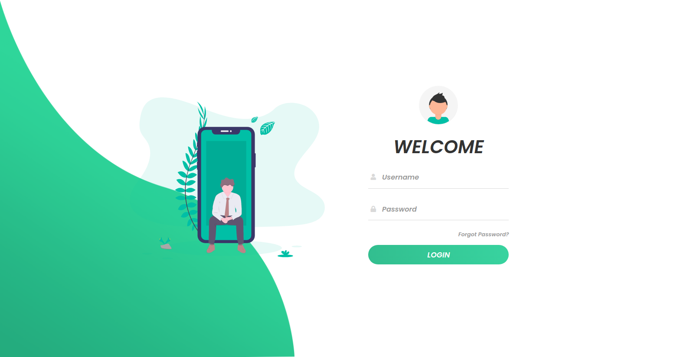

# Login Page 🔒

 

   

<!-- > Exemple (optional) -->
---

# :pushpin: Summary

* [Features](#rocket-features)
* [Getting Started](#runner-getting-started)
* [License](#closed_book-license)

# :star: Features

- responsive login page;
- Smooth animation.

# :rocket: Getting Started

Open the **``index.html``** file in a browser.

# :closed_book: License

Released in 2020.
This project is under the [MIT license](https://github.com/lukassousaf/login-page/blob/master/LICENSE).
